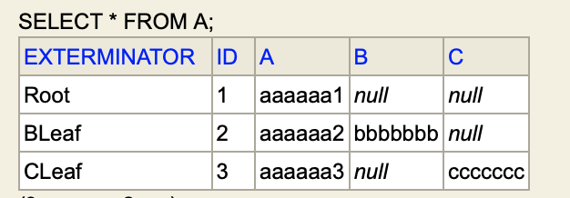
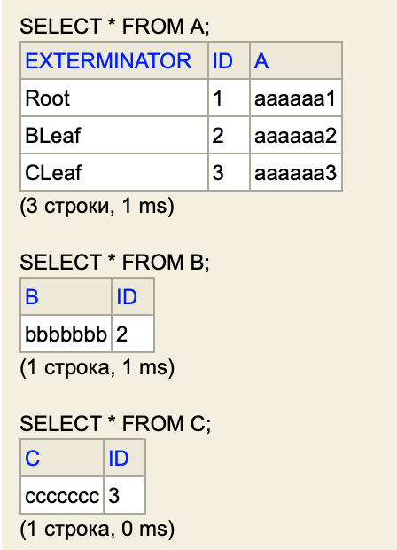
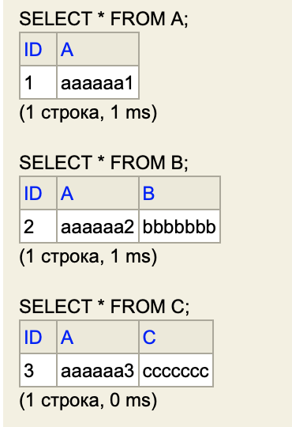

```java
@Entity
@DiscriminatorColumn(name = "exterminator")
@DiscriminatorValue("Root")
@Inheritance(strategy = InheritanceType.?)
@Table(name = "A")
public class A {
    @Id
    @GeneratedValue(strategy = GenerationType.SEQUENCE)
    protected long id;

    protected String a;

    public A() { }

    public A(long id, String a) {
        this.id = id;
        this.a = a;
    }
}

@Entity
@Table(name = "B")
@DiscriminatorValue("BLeaf")
public class B extends A {
    private String b;

    public B() { }

    public B(long id, String a, String b) {
        super(id, a);
        this.b = b;
    }
}

@Entity
@Table(name = "C")
@DiscriminatorValue("CLeaf")
public class C extends A {
    private String c;

    public C(long id, String a, String c) {
        super(id, a);
        this.c = c;
    }
}
```
-------------------------------------------
#### @Inheritance(strategy = InheritanceType.SINGLE_TABLE)

-------------------------------------------

#### @Inheritance(strategy = InheritanceType.JOINED)

-------------------------------------------

#### @Inheritance(strategy = InheritanceType.TABLE_PER_CLASS)

