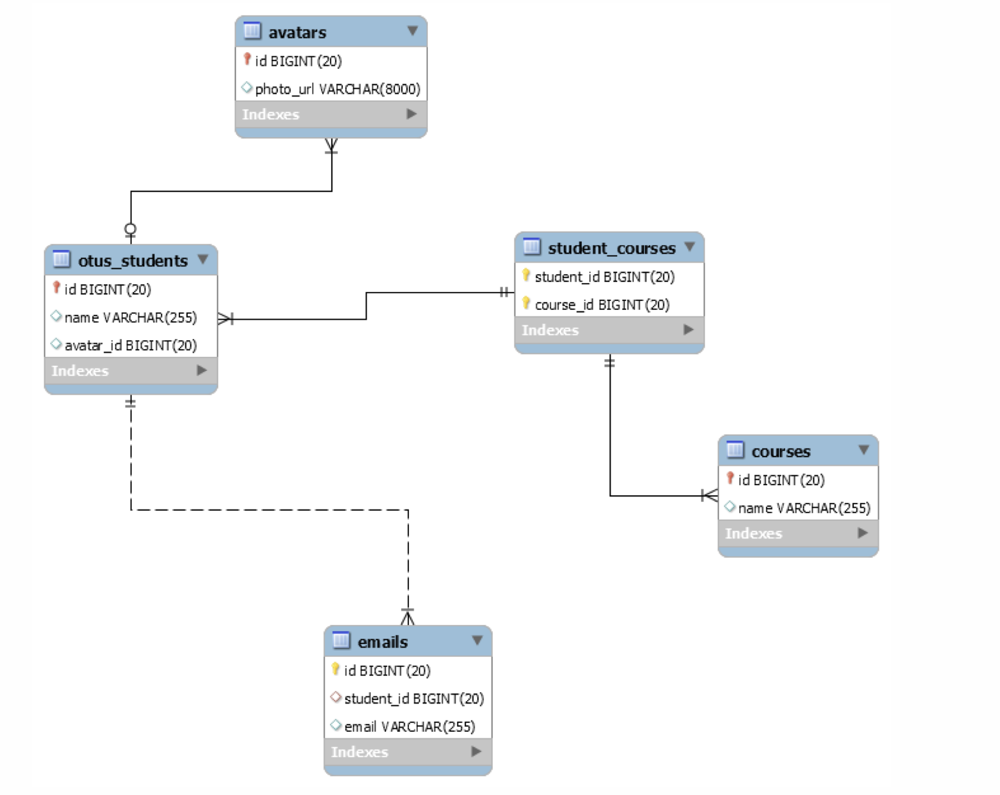

-------------------------------------------------------

### Про двунаправленные связи

Без ```mappedBy``` ORM считает, что у него просто две связи в разные стороны, 
а не одна двунаправленная.

```java
@Entity
@Table(name = "students")
public class UniversityStudent { 
    @OneToOne
    private Avatar avatar;
}

@Entity
@Table(name = "avatars")
public class Avatar { 
    @OneToOne
    private UniversityStudent student;
}
```

```sql
create table avatars (
   id bigint generated by default as identity,
    photo_url varchar(255), 
    student_id bigint, primary key (id)
);

create table students (
   id bigint generated by default as identity,
    student_name varchar(255), 
    avatar_id bigint,
    primary key (id)
)
```
-------------------------------------------------------
```mappedBy``` указывает владельца связи, т.е. в какой таблице будет связующий столбец.

```java
@Entity
@Table(name = "students")
public class UniversityStudent {
    @OneToOne (mappedBy="student") 
    private Avatar avatar;
}

@Entity
@Table(name = "avatars")
public class Avatar { 
    @OneToOne
    private UniversityStudent student; 
}
```
```sql
create table avatars (
   id bigint generated by default as identity,
    photo_url varchar(255),
    student_id bigint,
    primary key (id)
);

create table students (
   id bigint generated by default as identity,
    student_name varchar(255),
    primary key (id)
);
```
-------------------------------------------------------
```java
@Entity
@Table(name = "students")
public class UniversityStudent {
    @OneToOne
    private Avatar avatar;
}

@Entity
@Table(name = "avatars")
public class Avatar {
    @OneToOne (mappedBy="avatar")
    private UniversityStudent student; 
}
```

```sql
create table avatars (
   id bigint generated by default as identity,
    photo_url varchar(255),
    primary key (id)
);

create table students (
   id bigint generated by default as identity,
    student_name varchar(255),
    avatar_id bigint,
    primary key (id)
);
```