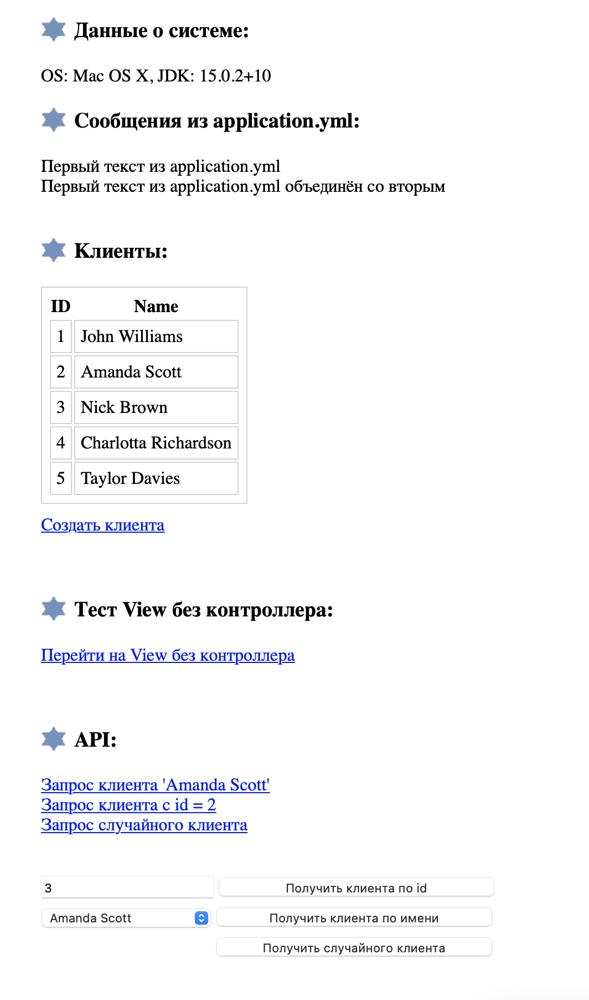

-------------------------------
Spring Boot - это утилита для быстрой настройки приложений, предлагающая готовую конфигурацию для создания приложений на базе Spring.   
Spring объединяет широкий спектр различных модулей под своей эгидой, таких как spring-core, spring-data, spring-web (включая Spring MVC) и так далее. С помощью Spring Boot можно сказать Spring, сколько из них использовать, и получить быструю настройку для них (при необходимости их можно изменить его самостоятельно позже).  
Итак:
- Spring MVC - это веб-фреймворк.
- Spring Boot - это готовый к работе инициализатор проекта на основе Spring. 

Spring Boot:
- Не требует развертывания war-файлов 
- Создает автономные приложения 
- Помогает напрямую встроить в приложение Tomcat, Jetty или Undertow 
- Не требует XML-конфигурации 
- Направлен на уменьшение объема исходного кода 
- Имеет дополнительную функциональность «из коробки» 
- Простота запуска 
- Простая настройка и управление

Spring Boot использует Spring Framework в качестве своей основы. 
Он упрощает зависимости Spring и запускает приложения прямо из командной строки. 
Он также не требует наличия внешнего контейнера приложений. 
Spring Boot помогает контролировать компоненты приложения и настраивает их извне.