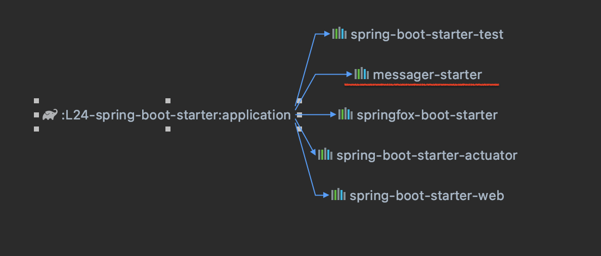

Starter - сборка необходимых зависимостей + дефолтные параметры для реализации определённого функционала.

Благодаря messager-starter, мы можем обратиться в application к messager (messager - приложение без использования Spring) и задать для него в application.yml нужные параметры конфигурациии.  
То есть в итоге мы внедрили в Spring Boot - приложение функционал, который изначально никакого отношения к Spring Boot'у не имел.  
Мы внедрили этот функционал с двух точек зрения: как бин и как субъект конфигурирования (т.е. по сути полностью включили его в нашу экосистему, и теперь он такой же компонент как и всё остальное)

Spring Boot позволяет с минимальными усилиями подключать ту или иную технологию без необходимости создавать десятки служебных бинов. 
Для этого имеются всевозможные starter-ы — специальные Maven/Gradle зависимости, которые необходимо только подключить в проект.
Принцип работы Starter'ов основан на двух специальных функциональностях Spring Boot — AutoConfigurations и Conditional.

Аннотация @EnableAutoConfiguration включает автоматическую настройку Spring ApplicationContext путем сканирования компонентов пути к классам и регистрации бинов, соответствующих различным условиям (@Conditional*).

Чтобы обеспечить большую гибкость условной регистрации bean-компонентов Spring, Spring 4 ввел концепцию @Conditional. Используя @Conditional, можно зарегистрировать компонент, условно основанный на любом произвольном условии.  
Примеры таких условий:  

|                                	|                                                                                                             	|
|--------------------------------	|------------------------------------------------------------------------------------------------------------	|
| ConditionalOnBean              	| Условие выполняется, в случае если присутствует нужный бин в BeanFactory.                                     |
| ConditionalOnClass             	| Условие выполняется, если нужный класс есть в classpath.                                                   	|
| ConditionalOnCloudPlatform     	| Условие выполняется, когда активна определенная платформа.                                                 	|
| ConditionalOnExpression        	| Условие выполняется, когда SpEL выражение вернуло положительное значение.                                  	|
| ConditionalOnJava              	| Условие выполняется, когда приложение запущено с определенной версией JVM.                                 	|
| ConditionalOnJndi              	| Условие выполняется, только если через JNDI доступен определенный ресурс.                                  	|
| ConditionalOnMissingBean       	| Условие выполняется, в случае если нужный бин отсутствует в BeanFactory.                                   	|
| ConditionalOnMissingClass      	| Условие выполняется, если нужный класс отсутствует в classpath.                                            	|
| ConditionalOnNotWebApplication 	| Условие выполняется, если контекст приложения не является веб контекстом.                                  	|
| ConditionalOnProperty          	| Условие выполняется, если в файле настроек заданы нужные параметры.                                        	|
| ConditionalOnResource          	| Условие выполняется, если присутствует нужный ресурс в classpath.                                          	|
| ConditionalOnSingleCandidate   	| Условие выполняется, если bean-компонент указанного класса уже содержится в BeanFactory и он единственный. 	|
| ConditionalOnWebApplication    	| Условие выполняется, если контекст приложения является веб контекстом.                                     	|