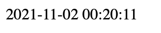
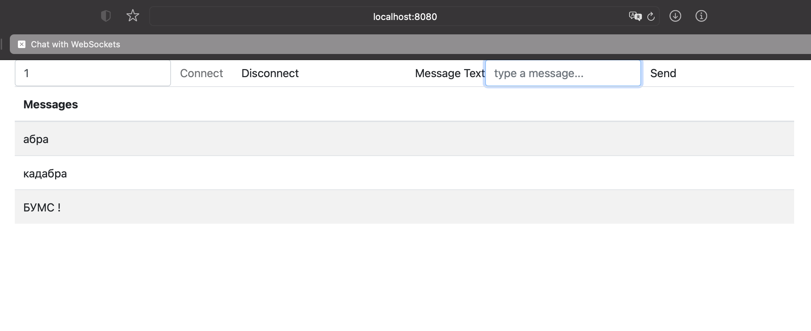

Протокол WebSocket (спецификация RFC 6455) обеспечивает возможность обмена данными между браузером и сервером через постоянное соединение. 
Данные передаются по нему в обоих направлениях в виде «пакетов», без разрыва соединения и дополнительных HTTP-запросов.

Клиент устанавливает соединение, выполняя процесс так называемого рукопожатия WebSocket. 
Этот процесс начинается с того, что клиент отправляет серверу обычный HTTP-запрос. 
После завершения фазы рукопожатия, исходное HTTP-соединение заменяется на WebSocket-соединение, которое использует то же самое базовое TCP/IP-соединение (бинарный протокол). 
В этот момент и клиент и сервер могут приступать к отправке данных.

---------------
1.Current time:
 - with ajax
 - with websockets  
 

---------------

2.Chat (with websockets)  

 
 