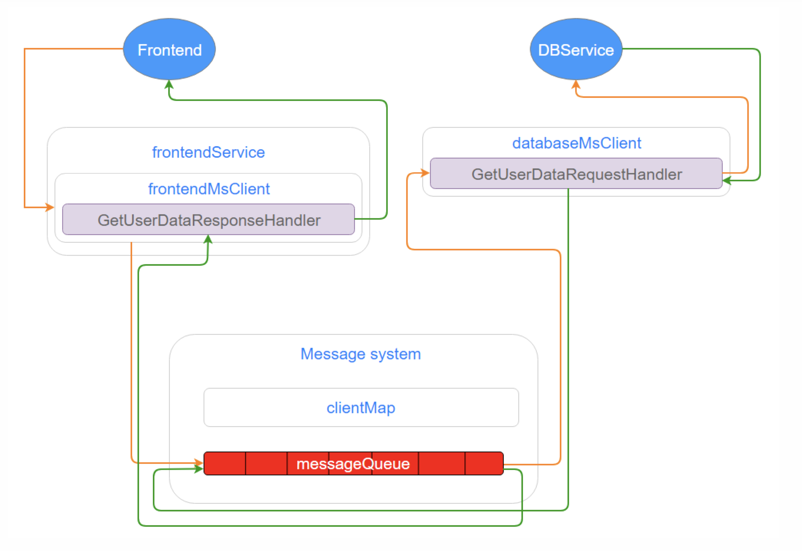
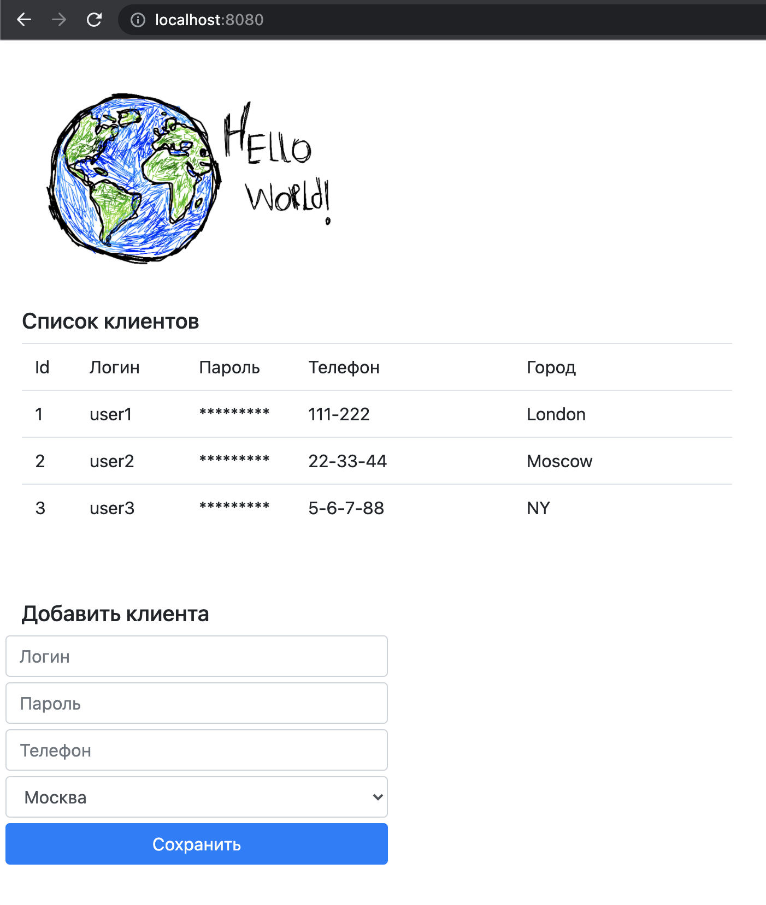

1. Запрос от фронтенда приходит в frontendService (в примере это main)
2. Создается сообщение
3. В сообщение, складывается лямбда типа MessageCallback, которая должна будет вернуться в ответном сообщении
4. С помощью клиента системы сообщение отправляется в MS, где кладется в очередь
5. Поток, распределяющий сообщения, срывается с блокировки, находит клиента-адресата сообщения
6. И запускает обработку данного сообщения клиентом в отдельном потоке из имеющегося пула
7. Клиент по типу сообщения находит для него обработчик и делегирует обработку ему
8. Обработчик идет в БД, загружает данные и формирует ответное сообщение (перекладывая в него лямбду), и отправляет его в MS
9. Далее происходят те же действия, что и в п 5-7
10. Обработчик ответного сообщения выполняет MessageCallback, отдавая ему переданные с сообщением данные

Типовая схема:  
Через вебсокет пришло сообщение (например, запрос списка клиентов) ->  
-> мы формируем сообщение ("запрос списка клиентов"), ->  
-> через видоизмененный FrontendService отправляем это сообщение в `MessageSystem`, ->  
-> оно доходит до хендлера, он дергает базу данных, формирует список клиентов, формирует ответное сообщение, в этом ответном сообщении пересылает список клиентов, ->  
-> в этот момент срабатывает лямбда, которая отправляет это обратно на вебстраницу уже в виде списка

------------------------------------------------------------------------------------

