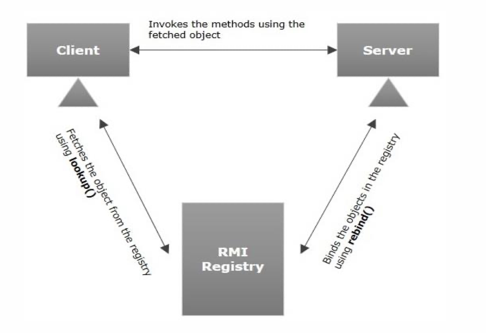

RMI – Remote Method Invocation, Т.е. удаленное выполнение методов. 
Служит для выполнения логики в одном приложении, с помощью вызова методов в другом.
Достаточно старая технология, работает только в java

RMI – участники процесса
- Интерфейс, наследующий java.rmi.Remote. На его основе будет создан клиентский прокси. И его должен будет реализовать класс, выполняющий логику на стороне сервера.
- Так же “серверная” часть должна быть наследником RemoteServer и быть зарегистрирована в реестре подключений (java.rmi.registry.LocateRegistry).

