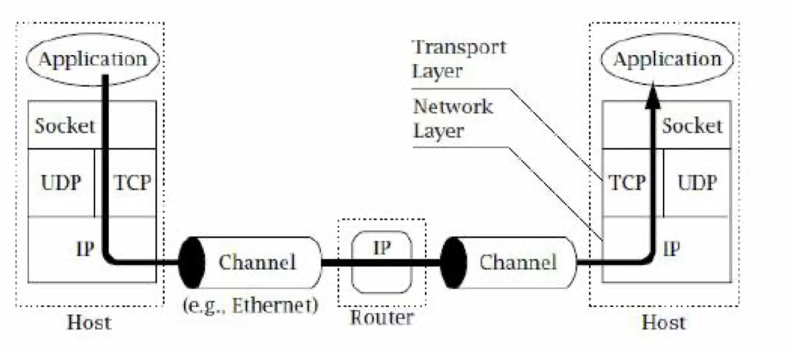

Сокеты лежат в основании практически всех верхнеуровневых протоколов (http, например)

Ключевое отличие сокетов от других сетевых инструментов Java (таких как HttpRequest, SMTPTransport и др.) состоит в том, что:
- Сокеты представляют собой достаточно низкоуровневый интерфейс.
Это позволяет работать напрямую через протокол TCP/IP и тем самым обеспечивает универсальность.
- Сокеты позволяют обеспечить обмен данными в режиме достаточно приближенном к реальному времени.
При отсутствии задержек при обработке и передаче данных обмен происходит с очень высокой скоростью.

Преимущества сокетов перед rest'ом:
- Постоянное соединение + канал есть в обе стороны (для tcp ip, для udp подключение в одну сторону)
- Нет избыточности: можем передавать только нужную информацию. Нет необходимости преобразовывать её в строки/json'ы. Можно отправить информацию прямо в байтах без каких-либо название полей и прочего

Недостаток сокетов, по сути является продолжением их достоинств.  
Универсальность и работа на низком уровне неизбежно порождает неудобство при работе с распространёнными протоколами (того же HTTP). 
Поэтому для них лучше использовать высокоуровневые средства. 
Но, подобные протоколы, к сожалению, не покрывают весь спектр задач сетевого программирования. 
Поэтому программирование на сокетах по-прежнему остаётся актуальным.
