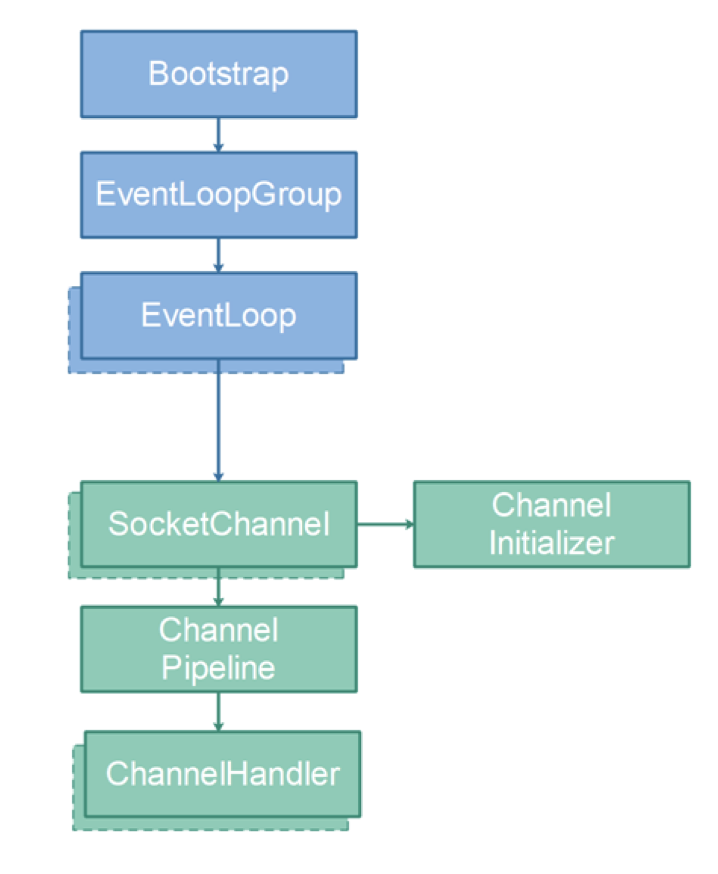
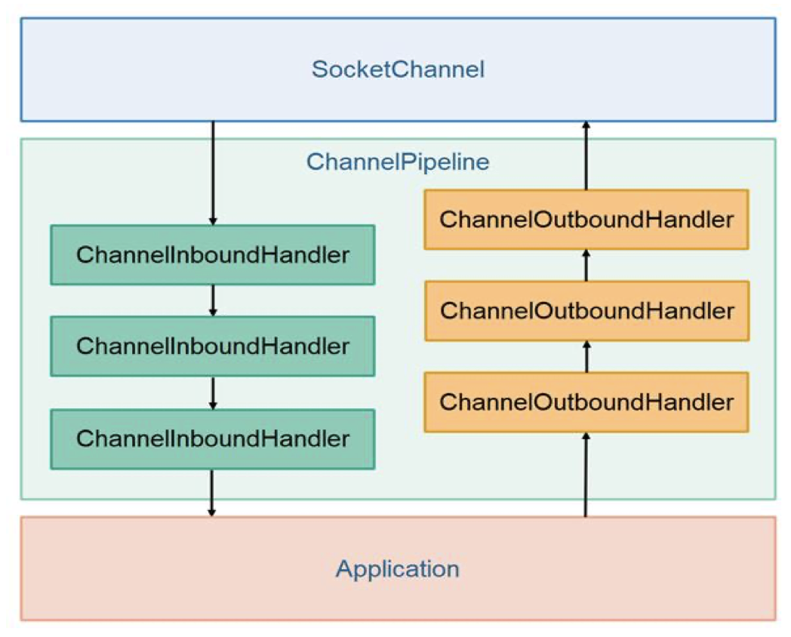

Netty – фактически не имеет аналогов и находится в основе почти всех фремворков, имеющих функционал сетевого взаимодействия.

От низкоуровневого к высокоуровневому:  
nio -> netty -> reactor -> webflux
